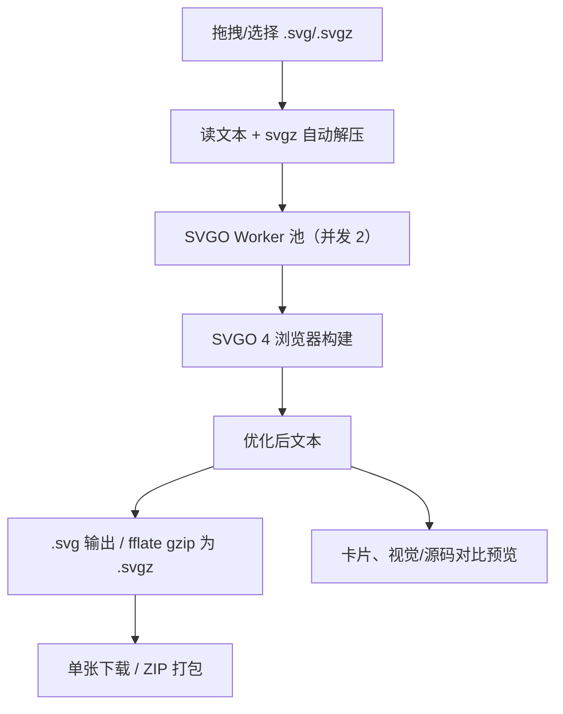

# 开发工具包 · SVG 压缩模块 — 技术方案

> 版本：v0.2（新增）  
> 日期：2026-08-08  
> 配套文档：[SVG压缩模块-需求文档](./SVG压缩模块-需求文档.md)、[公共技术方案](./公共技术方案.md)

## 1. 模块专属依赖

| 能力 | 选型 | 说明 |
| --- | --- | --- |
| 优化引擎 | `svgo` v4（`svgo/browser` 官方浏览器构建） | 纯 ESM 无 Node 依赖，Worker 内动态加载 |
| gzip / ZIP | `fflate`（公共依赖） | .svgz 输出与导入解压、ZIP 打包 |

## 2. 定位与架构差异

SVG 是矢量文本而非位图，图片模块的“解码 → Canvas 重绘 → 编码”管线不适用。SVG 工具走**文本优化管线**，但复用工具箱的批量列表、ZIP 下载、对比预览等共享设施。

## 3. 技术选型

| 项 | 选型 | 说明 |
| --- | --- | --- |
| 优化引擎 | `svgo` v4（`svgo/browser` 官方浏览器构建） | 行业标准，纯 ESM 无 Node 依赖；SVGOMG 同方案 |
| 执行环境 | Web Worker（模块 Worker，`worker.format: 'es'`） | SVGO 是同步 CPU 密集计算，放 Worker 避免阻塞 UI |
| 并发 | 自研轻量 Worker 池（默认 2） | 任务排队、失败自动换新 Worker |
| 体积控制 | 动态 `import('svgo/browser')` | svgo 单独成 chunk（≈553KB），首次压缩时才加载，主包零增长 |
| gzip | `fflate`（已有依赖） | `.svgz` 输出与导入时自动解压 |
| ZIP | `fflate`（已有） | SVG 文本场景启用 ZIP 压缩（level 6）；svgz 场景 level 0 |

## 4. 三档预设

全部不启用几何简化（不做路径抽稀），保证“高保真”：

| 档位 | floatPrecision | multipass | 额外插件 | 保证 |
| --- | --- | --- | --- | --- |
| 高保真 | 3 | 否 | — | 渲染一致 |
| 平衡 | 2 | 是 | `convertOneStopGradients` | 视觉无损 |
| 极限 | 2 | 是 | `convertOneStopGradients`、`reusePaths` | 视觉无损；与平衡档双跑取小，结果 ≤ 平衡档 |

## 5. 关键设计

- Worker 协议：`{ id, input, preset }` → `{ id, ok, text | error }`，池按 id 路由回调用方；页面卸载时 `terminate()` 全部 Worker。
- 预览 URL 始终指向未压缩的优化文本 Blob（svgz 无法被浏览器直接渲染），下载 Blob 按所选格式输出。
- “保留原文件”策略与图片模块一致：优化结果 ≥ 原文件时输出原文件并标注，避免更差结果。
- 极限档在 Worker 内“平衡 + 极限”双配置各跑一次取小，保证不劣于平衡档（`reusePaths` 对小文件有 defs/use 开销）。
- 共享组件抽取：`FileDropZone`、`SliderCompare`、`HelpTip` 迁至 `src/shared/components/`，图片模块同步复用。

## 6. 风险与对策

| 风险 | 影响 | 对策 |
| --- | --- | --- |
| SVGO 同步计算阻塞 UI | 页面卡死 | Web Worker 池承载 |
| 极限档双跑耗时翻倍 | 单张处理变慢 | 仅极限档启用；并发池 + 进度反馈 |
| `reusePaths` 在小文件上反而变大 | 压缩效果差 | 双方案取小，结果 ≤ 平衡档 |
| svgz 无法被浏览器直接渲染 | 预览缺失 | 预览始终使用未压缩优化文本 Blob |
| 超大/畸形 SVG 拖慢或失败 | 处理卡顿、报错 | 20MB 上限；解析失败明确提示 |
