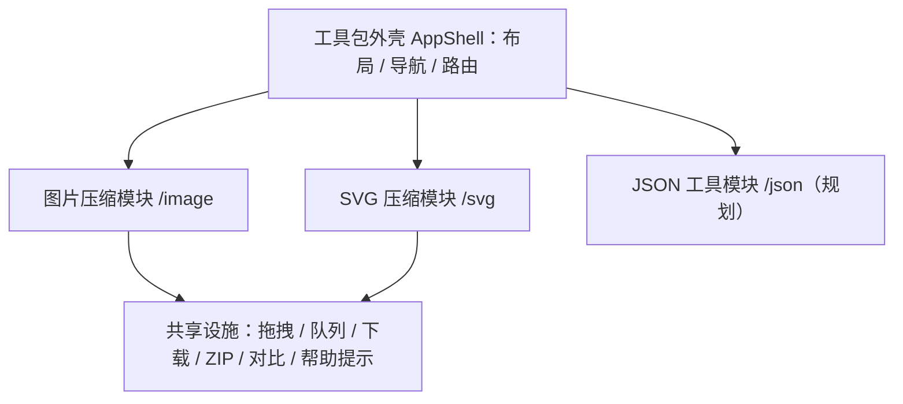

# 开发工具包 — 公共技术方案

> 版本：v0.2（草案）  
> 日期：2026-08-08  
> 配套文档：[公共需求](./公共需求.md)  
> 适用范围：所有模块共用的架构、技术栈、基础设施与部署

## 1. 总体架构

纯前端单页应用（SPA），无后端、无数据库。所有处理在浏览器内完成，构建产物为静态文件，可部署到任意静态托管平台。



- 各模块逻辑与 UI 独立成 `features/*`，公共能力收敛到 `shared/`，文案统一在 `shared/i18n/zh.ts`。
- 图片压缩走**位图管线**（解码 → 重绘 → 编码），SVG 压缩走**文本管线**（解析 → 优化 → 序列化），两者共享外壳与通用组件。

## 2. 公共技术栈

| 类别 | 选型 | 说明 |
| --- | --- | --- |
| 框架 | React 18 + TypeScript | 长期维护，类型安全 |
| 构建 | Vite 5 | 快、产物静态、支持 Worker 与动态 import 分包 |
| 路由 | react-router-dom（HashRouter） | 工具包多页面导航（/image、/svg、/json） |
| ZIP 打包 | fflate | 轻量（≈8KB gzip），支持流式，避免 JSZip 的 ~100KB |
| 状态管理 | React 内置 + Context | 规模可控，暂不引入 Redux/Zustand |
| 样式/响应式 | CSS Modules + CSS 变量 | 断点 <768px 移动端单列、≥1024px 桌面多列；不引入重型 UI 库 |
| 测试 | Vitest | 与 Vite 同生态；另有 Playwright e2e 冒烟脚本 |
| 代码规范 | ESLint + Prettier | 工程标准配置 |

**依赖原则**：核心路径优先使用浏览器原生能力；无法原生完成的（ZIP、SVG 优化）使用成熟第三方库，且通过动态 import / Worker chunk 按需加载，不拖累首屏。

模块专属依赖见各模块技术方案。

## 3. 目录结构规划

```text
developer-kits/
├─ docs/                    # 文档索引、公共文档、各模块文档
├─ scripts/                 # e2e 冒烟测试脚本（图片、SVG）
├─ test-images/             # 测试素材（含 SVG / SVGZ 场景）
├─ src/
│  ├─ app/                  # 应用外壳：布局、导航、路由
│  ├─ features/
│  │  ├─ image-compressor/  # 图片压缩模块
│  │  ├─ svg-compressor/    # SVG 压缩模块
│  │  └─ json-tools/        # 预留：JSON 工具
│  ├─ shared/
│  │  ├─ components/        # FileDropZone、SliderCompare、HelpTip
│  │  ├─ hooks/             # useDebouncedEffect 等
│  │  ├─ i18n/              # 文案资源（zh.ts）
│  │  └─ lib/               # 下载、体积/压缩率格式化
│  ├─ styles/global.css
│  └─ main.tsx
├─ index.html
└─ package.json
```

## 4. 公共基础设施

### 4.1 外壳与路由

- `AppShell` 提供侧边导航与内容区，`HashRouter` 路由到各模块页面。
- 每个模块一个路由文件 + 独立页面组件，新增工具时零侵入地加导航项与路由。

### 4.2 共享组件与文案

- `FileDropZone`：拖拽 / 点击选择，支持自定义 accept、选择器类型、过滤函数与移动端降级文案。
- `SliderCompare`：滑动对比，Pointer Events 统一鼠标与触摸。
- `HelpTip`：桌面 hover / 点击气泡，移动端居中弹层。
- `imageHasTransparency`：导入时缩小采样扫描 alpha 通道，自动判定透明区域预览背景（透明 → 棋盘格，不透明 → 白色），卡片与对比弹窗统一生效。
- 所有文案收敛到 `shared/i18n/zh.ts` 的 `app` / `image` / `svg` 命名空间，组件不硬编码。

### 4.3 批量处理与并发原则

- 通用原则：任务状态机 `pending → processing → done | error`；全局参数变更后整体重跑；单张失败不阻塞其他任务；页面卸载时终止进行中的工作并释放资源。
- 图片模块用异步流水线 + 并发控制（默认 2）；SVG 模块用 Web Worker 池（默认 2）承载同步计算。

### 4.4 ZIP 下载

- `buildZipBlob(files, level)`：`fflate` 打包，自动处理重名（追加 `(1)`、`(2)`）。
- 默认 level 0（位图本身已压缩）；文本类内容（SVG）传 level 6 让 ZIP 层也压缩。

### 4.5 响应式与触控

- 布局策略：桌面端“侧边设置栏 + 多列卡片网格”；移动端单列 + 抽屉式设置面板，断点与间距统一收敛到 CSS 变量。
- 拖拽上传降级：移动端（`pointer: coarse`）隐藏拖拽提示，点击即选择。
- 对比预览组件统一使用 Pointer Events，鼠标与触摸共用一套逻辑。

## 5. 部署方案

**结论先行：纯前端静态站点，不需要云服务器（ECS/轻量服务器），不需要安装 Node、Nginx 等任何环境。** 选择支持静态托管的平台，把构建产物（`dist/`）托管上去即可。

### 5.1 可选方案对比

| 平台 | 成本 | 部署方式 | 国内访问 | 备注 |
| --- | --- | --- | --- | --- |
| Vercel | 免费 | 连 GitHub 自动构建 | 一般（时快时慢） | 最省事，适合快速上线验证 |
| Cloudflare Pages | 免费 | 连 GitHub 自动构建 | 一般（线路不稳定） | 免费额度大，无需绑卡 |
| Netlify | 免费 | 连 GitHub 自动构建 | 一般 | 同 Vercel |
| GitHub Pages | 免费 | 推送分支自动构建 | 一般 | 无需额外平台，功能最简单 |
| 阿里云 OSS + CDN | 按量计费（个人使用每月几元量级） | 上传静态文件或 CI 同步 | 快 | 需备案域名，国内正式上线首选 |
| 腾讯云 COS + CDN | 按量计费 | 同上 | 快 | 同阿里云，按需选择 |

### 5.2 推荐路径

1. **快速验证（现在）**：代码推到 GitHub，接入 Vercel 或 Cloudflare Pages，一个分支推送即自动上线，免费且零配置。
2. **国内正式上线（有域名后）**：购买域名并备案，用阿里云 OSS 静态网站托管 + CDN 加速，构建产物直接同步到 OSS Bucket（可用 GitHub Actions 或 `ossutil` 一键同步），无需在服务器上安装任何东西。

### 5.3 部署无关性

由于是纯静态站点，部署平台可以随时切换：换平台只影响域名和构建配置，代码零改动。v0.2 阶段不绑定任何特定平台。

## 6. 里程碑

| 阶段 | 内容 | 产出 |
| --- | --- | --- |
| M1 工程搭建 | Vite + React + TS 工程、路由、工具包外壳 | 可运行骨架 |
| M2 图片压缩核心 | 导入、Canvas 编码、两种模式、队列 | 核心可用 |
| M3 批量与下载 | 列表、进度、ZIP、对比预览 | 完整 v0.1 |
| M4 打磨与部署 | 响应式与触控打磨、错误处理、性能调优、静态部署 | 上线 v0.1 |
| M5 SVG 压缩（v0.2） | SVGO Worker 管线、三档预设、svgz、批量/ZIP/源码对比 | 上线 v0.2 |
